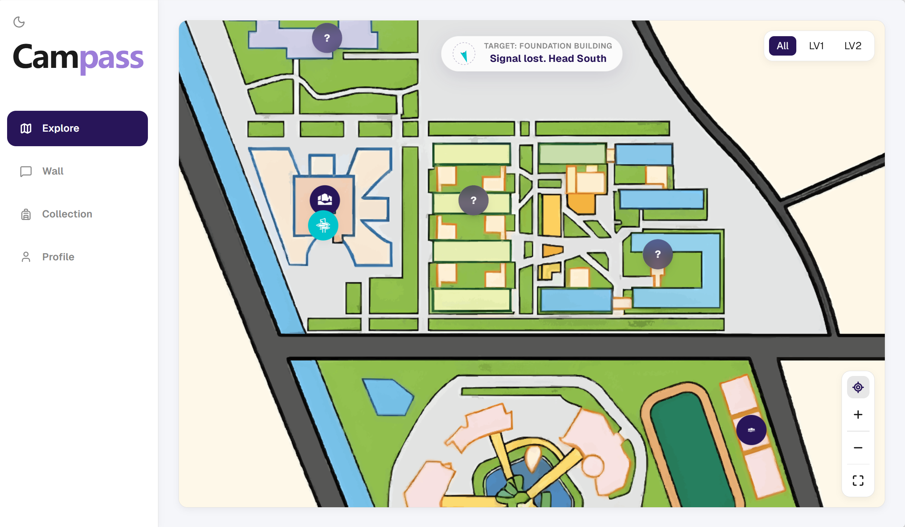
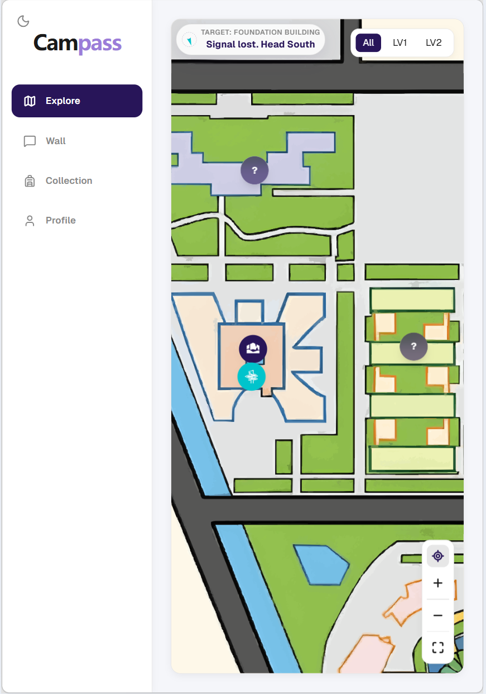
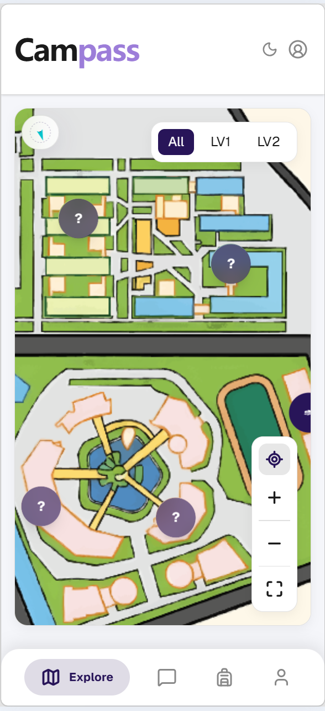
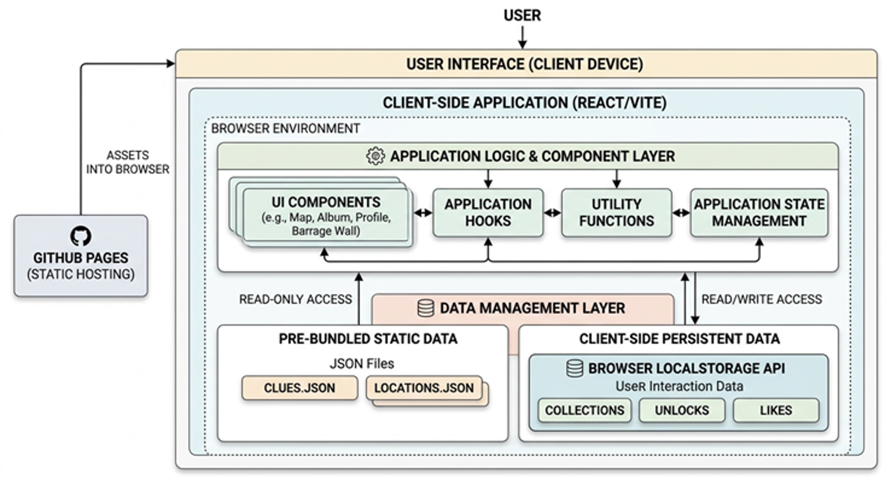

# Campass Tour Prototype

Campass Tour Prototype is a React + Vite web experience for campus exploration. It combines an interactive map, collectible mascot check-ins, clue-based landmark discovery, an AR/model-viewer flow, a social "Wall" for user messages, and a wardrobe studio for character customization.

The current version is frontend-first: static data + browser persistence provide fast interaction during prototyping, while the architecture stays ready for full-stack migration.

## Table of Contents

- [Live URL](#live-url)
- [Setup](#setup)
- [Technologies Used](#technologies-used)
- [Core Features](#core-features)
- [Responsive Design](#responsive-design)
- [Architecture Overview](#architecture-overview)
- [Data Handling Notes](#data-handling-notes)
- [NFC Debug FAB](#nfc-debug-fab)
- [AI Prompt Assets](#prompt-assets)
- [Project Structure](#project-structure)
- [Future Work](#future-work)

## Live URL

Production demo:  
https://campass-tour.github.io/prototype/

## Setup

### Prerequisites

- Node.js 18+ recommended
- npm 9+ recommended

### Install dependencies

```bash
npm install
```

### Start the development server

```bash
npm run dev
```

Then open `http://localhost:5173`.

### Build for production

```bash
npm run build
```

### Preview the production build locally

```bash
npm run preview
```

### Lint the codebase

```bash
npm run lint
```

## Technologies Used

- React 19
- TypeScript
- Vite
- React Router
- Three.js
- `@react-three/fiber`
- `@react-three/drei`
- `@google/model-viewer`
- Tailwind CSS
- Lucide React
- Swiper
- Lottie React
- `react-photo-view`
- `react-zoom-pan-pinch`
- Static JSON data files for preloaded content
- LocalStorage for client-side persistence

## Core Features

- Interactive campus exploration map
- Landmark check-in flow with mascot collection unlocking
- Clue-based content reveal from preloaded static data
- AR / 3D model viewing for unlocked mascots
- Social wall with searchable location-based whispers
- Wardrobe studio with persistent local customization state
- Mobile-friendly UI with progressive lazy loading

## Responsive Design

Campass is designed to adapt across screen sizes, including phone, tablet, laptop, and larger desktop layouts.

### Laptop



### Tablet



### Phone



## Architecture Overview

The system architecture diagram is shown below:



This diagram reflects three important architectural choices in the current prototype:

### Stateless to Stateful

**How:** The app uses `LocalStorage` to persist Collections (captured birds) and Unlocks (visited landmarks).

**Benefit:** User progress survives reloads immediately, without waiting for database queries, which enables instant feedback after check-in actions.

### Data Management Layer

**How:** Landmark and clue content is preloaded from static JSON files such as [`src/data/clues.json`](./src/data/clues.json).

**Benefit:** This reduces runtime fetching cost and helps keep Largest Contentful Paint (LCP) low, since most lookups behave like in-memory O(1) reads after the app is loaded.

### Modular Hook Architecture

**How:** Core client logic is encapsulated in custom React Hooks, such as [`src/hooks/useUnlockedCollectibles.ts`](./src/hooks/useUnlockedCollectibles.ts) and [`src/hooks/useWardrobeStudio.ts`](./src/hooks/useWardrobeStudio.ts).

**Benefit:** When the project migrates to a Next.js full-stack architecture, the UI layer can remain largely unchanged. The main work will be swapping or upgrading the data access hooks.

## Data Handling Notes

The current prototype is optimized for responsiveness rather than server integration.

- Persistent user progress is stored in [`src/lib/storage.ts`](./src/lib/storage.ts) and related local storage helpers.
- Check-in unlocks are triggered from URL parameters and immediately committed to browser storage in [`src/App.tsx`](./src/App.tsx).
- Landmark clues, comments, messages, locations, and other content are shipped as static JSON assets under [`src/data`](./src/data).
- This approach keeps the UI fast and predictable during demos, usability testing, and feature iteration.

## NFC Debug FAB

The NFC simulator FAB is a development and testing tool. It helps simulate NFC check-ins quickly during local testing.

If it is accidentally closed while testing, it can be reopened by tapping the Campass logo **5 times**. This behavior is implemented in [`src/App.tsx`](./src/App.tsx), and the simulator UI lives in [`src/components/common/NfcSimulatorFab.tsx`](./src/components/common/NfcSimulatorFab.tsx).

In addition, you can test check-ins by writing your own NFC sticker or URL payload.  
Use this URL prefix format:

`https://campass-tour.github.io/prototype/?checkin=cb`

The value after `checkin=` is the location id. You can look up valid ids in [`src/constants/locations.ts`](./src/constants/locations.ts).

## Prompt Assets

The [`.agents`](./.agents) directory stores prompt assets used during development.

- `skills/` contains global prompting guidance and reusable skills.
- `ai-logs/` contains important implementation-focused prompt records and concrete development notes (for example, [`ailog.md`](./.agents/ai-logs/ailog.md)).

## Project Structure

```text
src/
  components/    Reusable UI and feature components
  pages/         Top-level route views
  hooks/         Custom React hooks for app logic
  lib/           Utilities, storage, and data helpers
  data/          Static JSON data sources
  constants/     App constants and configuration
  assets/        Images, icons, and 3D models
```

## Future Work

We are actively refactoring this prototype into a Next.js full-stack architecture.

[](https://github.com/campass-tour/campass)
